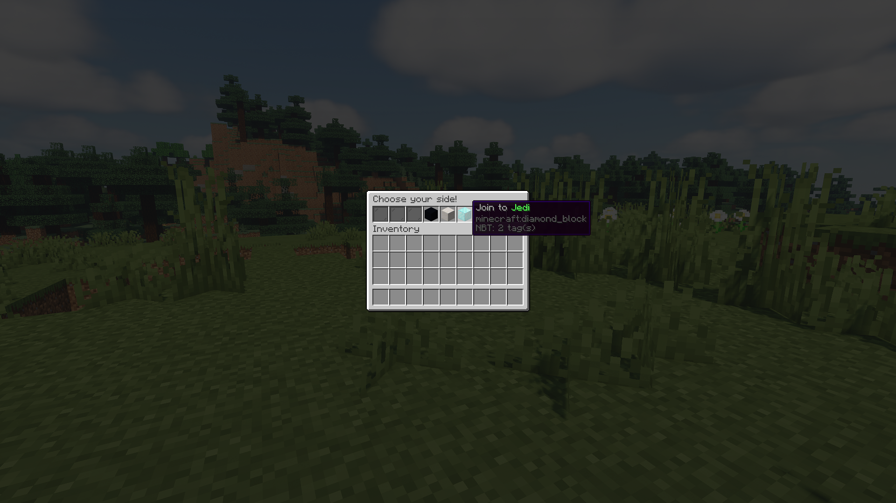

# Permanent clan

## What is it?

Usually, when you creating some clan, it requires having **at least 1 player** there. But sometimes, you need to have an empty clan, right? It is what permanent clans do.

## Where it can be useful?

There are plenty of variations on how to use this feature. For example:

* You want to sell a superior clan on your server and don't want to set a leader to that clan.
* You want to move the latest player of a clan to another clan.
* A clan for administrators: easy to join and leave.
* Clans for RPG server.
* etc.

### Particular examples

#### Using permanent clans with DeluxeMenus

You can join your players to clans using the menu:



YAML example:

```yaml
items:
    'jedi_clan':
        material: diamond_block
        slot: 5
        display_name: "&7Join to &aJedi"
        left_click_commands:
          - '[console] clan mod place %player_name% jedi'
          - '[close]' 
```

#### Using permanent clans with Citizens

Alternatively, you may want to join your players by NPC:


To do it, you need to:

1. Create an NPC: `/npc create <name>`
2. Set the command on player's clicking: `/npc command add clan -o mod place <p> jedi`

## How to use it?

You can use `/clan admin permanent [clan]` command to give permanent status to a clan.



**Warning**  
Permanent clans are not purged for inactivity and can't be disbanded by players.   
Use `/clan mod disband` instead.



**Note**  
This command work only ****if you're an administrator or   
if you have `simpleclans.admin.permanent` permission node.



