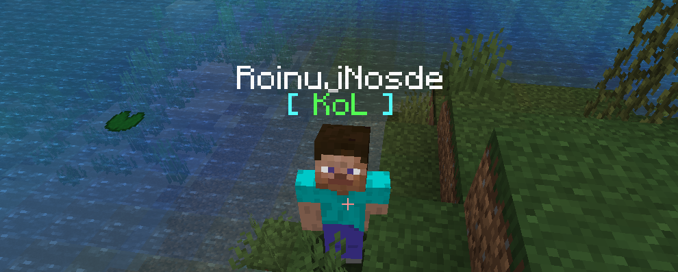

# Клан под ником игрока

## Необходимые плагины

* [PlaceholderAPI](https://www.spigotmc.org/resources/placeholderapi.6245/)
* [TAB](https://www.spigotmc.org/resources/tab-1-5-x-1-15-x-free-version.57806/) \(Вы можете использовать и другие плагины на таб, если он поддерживает PlaceholderAPI\)

## Пошагово

1. Откройте конфиг TAB и измените раздел groups, добавив %simpleclans\_clan\_color\_tag% к blowname:


```yaml
_OTHER_:
 tabprefix: "%vault-prefix% "
 tagprefix: "%vault-prefix% "
 tabsuffix: "%afk%"
 tagsuffix: "%afk%"
 customtabname: "%essentialsnick%"
 customtagname: "%essentialsnick%"
 belowname: "&l&b[ %simpleclans_clan_color_tag% &l&b]"
```


2. Найдите параметр `belowname` или `classic-vanilla-belowname` и выключите его.

3. Найдите параметр `unlimited-nametag-prefix-suffix-mode` и включите его.

4. Перезапустите сервер \(или перезагрузите конфиг `/tab reload`\) и наслаждайтесь!

## Скриншот



