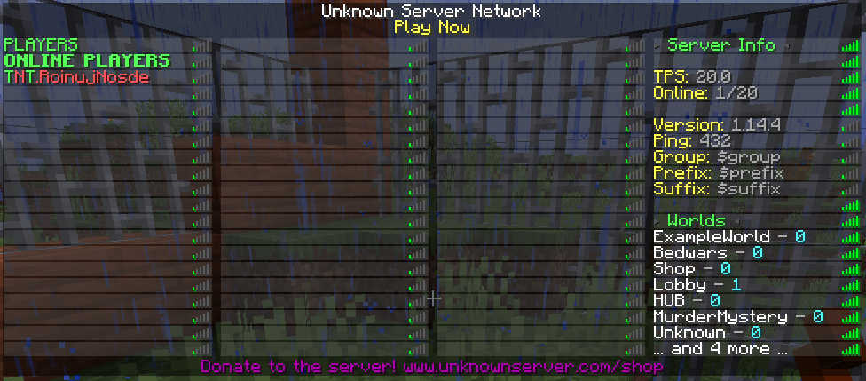

# Clan on Tablist

## Plugins needed

You can use a different tablist plugin, as long as it supports PlaceholderAPI

* [PlaceholderAPI](https://www.spigotmc.org/resources/placeholderapi.6245/)
* [TAB](https://www.spigotmc.org/resources/tab-1-7-x-1-16-5-free-version.57806/)

## Step by step

1. Open Tab' config and edit the formats adding `%simpleclans_clan_color_tag%`:


```yaml
Groups:
    _OTHER_:
        tabprefix: "%simpleclans_clan_color_tag%%vault-prefix% "
```


2. Restart \(or reload `/tab reload`\) and enjoy!

## Screenshot



